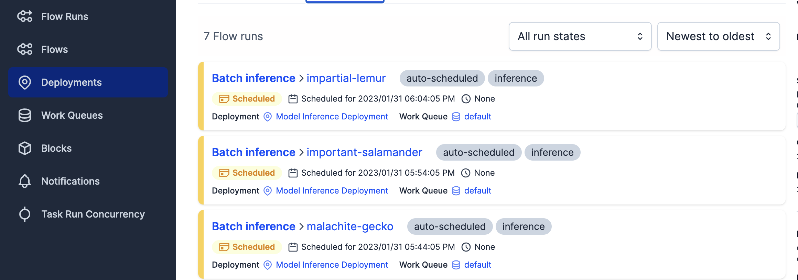

# Machine learning pipelines and Orchestration

> **Version** : 
> This module has been created using Prefect 2.7.9

## Intro and Use case Reminder

The project is *New York City Taxi trip duration prediction*. \
The goal is to use the available data in order to train a simple machine learning model
to predict the trip duration based on some input that can be available in production environment.

An ultimate goal for this use case can be to predict in real time trips durations (google-maps/waze like itinerary)
but for simplicity, in this module, we assume that we need batch prediction. The data for which we need predictions
will be stored in a file for ingestion in the trained model.

The machine learning phase is mainly constituted by the following steps : 
- data processing
- model training
- model evaluation
- prediction

The data to use for this module can be downloaded from the [TLC Trip Record Data page](https://www.nyc.gov/site/tlc/about/tlc-trip-record-data.page).
To complete this module, you will need 03 samples of data :
- `sample 1 example` : [yellow trip 2021-01 data](https://d37ci6vzurychx.cloudfront.net/trip-data/yellow_tripdata_2021-01.parquet) (to train model)
- `sample 2 example` : [yellow trip 2021-02 data](https://d37ci6vzurychx.cloudfront.net/trip-data/yellow_tripdata_2021-02.parquet) (to evaluate model)
- `sample 3 example` : [yellow trip 2021-03 data](https://d37ci6vzurychx.cloudfront.net/trip-data/yellow_tripdata_2021-03.parquet) (for prediction)

> **Disclaimer** :
> The volumes of data used in this module are not at all significant to have efficient models and 
interpretable performances. Here we use data volumes that fit locally and allow pipelines building and fast execution.

> **Data location** :
> Please create a "00-data" folder in the course root directory and put the downloaded files inside. \
> If names are different, please rename your files to "yellow_tripdata_2021-01.parquet" (2021-02 / 2021-03)

A notebook implementing the machine learning steps to predict Taxi trip duration can be found in the 
course' GitHub repository in the [introduction course](https://github.com/artefactory/supinfo_mlops_course/tree/master/01-intro).

## From notebook to Workflows :
#### *e.g. solution : orchestration_00_machine_learning.py*

First step before using prefect for orchestration is to transform our notebook into python files 
following known good practices.

**Exercise 1** : Convert notebook into python files (1/4)

Create/move the following functions in/to a file using the notebook's code and applying good code practices viewed :
- load_data
- compute_target
- filter_outliers
- encode_categorical_columns
- extract_x_y

**Exercise 2** : Convert notebook into python files (2/4) 

These steps constitute the data processing phase. \
Create a unique `processing` functions as entrypoint for all these steps.

> :bulb: This function should handle the two following cases : \
> **Fist case** : The data to process is destined to train a model : The target column is available \
> **Second case** : The data to process is destined to prediction : The target column is not available


**Exercise 3**: Convert notebook into python files (3/4)

Create five functions to complete the ML process : 
- Train model
- Evaluate model
- Predict
- An entrypoint function to perform all the previous steps  for training phase:
  - Process data
  - Train model
  - Evaluate model
- An entrypoint function for prediction:
  - Process data without target column
  - Predict
- Test your code with the downloaded data

> :bulb: Add a save/load step using `helpers.py` file, at the end of the ml pipeline to serialize your model and dict vectorizer.
These two element should be loaded for batch prediction.


**Exercise 4**: Convert notebook into python files (4/4)

- Execute the notebook in state and keep/save the results
- Test your entire code
- Compare results against notebook' results

> :bulb: You can import your main function inside the notebook to facilitate comparison

## Workflows orchestration with prefect : 

#### e.g. solutions : 
- *exercise 1 : orchestration_01_prefect_orion.sh*
- *exercise 2 : orchestration_02_first_flow.py*
- *exercise 3 : orchestration_03_machine_learning_workflow.py*
- *exercise 4 : orchestration_03_machine_learning_workflow.py*
- *exercise 5 : orchestration_04_prefect_deployment_objects.py*


**Exercise 1**: Set Up Prefect UI (1/5)

Before starting to implement tasks and flows with prefect, let's set up the UI in order to have a good visualization
of our work.

Steps : 
- Start a local prefect server : 
```
prefect orion start
```
- Set an API URL for your local server to make sure that your workflow will be tracked by this specific instance : 
```
prefect config set PREFECT_API_URL=http://127.0.0.1:4200/api
```

Prefect database is stored at : 
```
~/.prefect/orion.db
```

If you want to reset the database, run :
```
prefect orion database reset
```


**Exercise 2**: Create a data processing flow (2/5)

It is simple to create workflows with prefect. It uses @flow and @task decorators that can be directly import to
wrap your functions.
```
@task()
def my_function():
  ...
```

- Use the decorators `@task` and `@flow` to create your first prefect flow : The Processing flow. \
Prefect will try to use by default different thread to run each task. If you want sequential steps, introduce this
dependencies through the name of each task output.
- Test your code by calling the flows run with downloaded data
- Visualize in the local prefect UI

> :warning: **Typing tasks and flows in prefect** : \
Typing tasks in prefect is done as with any python code. \
For flows, either use `validate_parameters=False`
or define pydantic models for prefect to understand
your NON DEFAULT typing (see extra section). 

> But if all tasks are typed, since flows are just set of tasks, it should be all good if we don't want to add a layer of complexity \
> `Default types` : str, int ...


**Exercise 3**: Customize your flows (3/5)

You can configure the properties and special behavior for your prefect tasks/flow in the decorator.
For example, you can tell if you want to retry on a failure, set name or tags, etc... \
An example is given in the `helpers.py` file.
```
@task('name=failure_task', tags=['fails'], retries=3, retry_delay_seconds=60)
def func():
  ...

```

- Add names, tasks, and desired behavior to your tasks/flows
- Test your code
- Visualize in the local prefect UI

If a task fails in the flow, it is possible to visualize which task fail and access the full log and traceback error
by clicking on the tasks. \
We can also access run information inside de `state` object that can be returned by the flows using python code

 


**Exercise 4** : Create machine learning flows (4/5)

Create the complete ML process flow : 
- Process data
- Train model
- Evaluate model
- Save model and vectorizer (dv) | use helpers
- Predict 

Create the prediction flow:
- Load model and vectorizer
- Process data without target column
- Predict

- Test your code
- Visualize in the UI


**Exercise 5** : Create flows deployments with prefect (5/5)

Example of code : 

```
from prefect.deployments import Deployment
from prefect.orion.schemas.schedules import (
   CronSchedule,
   IntervalSchedule,
)

shcedule_examples = [
    IntervalSchedule(interval=600)
    CronSchedule(cron="0 0 * * 0")
] 

dep = Deployment.build_from_flow(
    name="<random name>",
    flow=<existing flow>,
    version="<random version>",
    tags=["random tag"],
    schedule=null,
    parameters={...}
)
```


Now that all the workflows are defined, we can now schedule automatics runs for these pipelines. \
Let's assume that we have a process that tells us that our model need to be retrained weekly based on 
some performance analysis. We also receive data to predict each hour.

Use prefect deployment object in order to : 
- Schedule complete ml process to run weekly
- Schedule prediction pipeline to run each hour

> To submit a deployment object, it needs to be applied using the `apply` parameter or the `.apply()` method.
> A **prefect agent** is then needed to initiate the automatic runs.
> When a deployment is created, it is by default added to the **default** work queue
> ```
> prefect agent start default
> ```



## More concepts with orchestration & prefect


#### Prefect runners

Prefect offer possibility to use different types or runners for flows in order to distribute the workload. \
This course don't include any cloud resource, so there will only by Sequential and Concurrent runners available.

```
from prefect import flow
from prefect.task_runners import SequentialTaskRunner, ConcurrentTaskRunner

@flow(task_runner=SequentialTaskRunner)
def my_flow():
  independant_task_1()
  independant_task_2()
  independant_task_3()
```

- Try a flow (previous or simple custom) using different types of runners

#### Custom typing with Pydantic

It is possible to create custom validator for functions/flows inputs to helps prefect understand the 
exact requirements needed for an input.

```
from pydantic import BaseModel, validator
class CustomType(BaseModel):
  input_1 : type
  input_2 : type
  ...
  
  @validator('input_1', 'input_2')
  def make_specific_test():
    ...
```

- Create typing for the previous prefect flows and test your code
