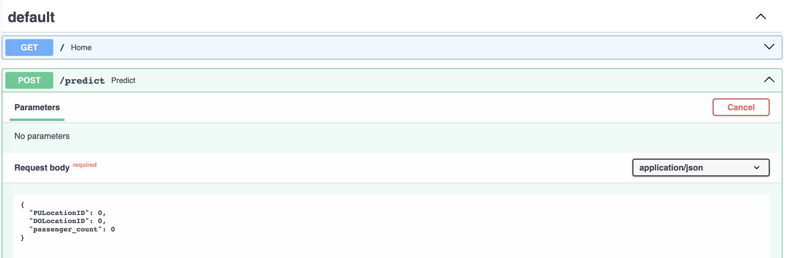

# Model Deployment

## Introduction

In this module, we will learn how to:

- Deploy a model
- Create a [REST API](https://www.ibm.com/topics/rest-apis) to serve our model predictions
- Dockerize the API

Machine learning models are complex objects with numerous dependencies, such as specific feature transformations, a set of training data, hyperparameters, etc. If all consumers had to deal with this complexity to use these models, large organizations would struggle to extract value from them.

Model deployment is the process of making a machine learning (ML) model accessible to users. It involves creating an interface through which a user can interact with the developed model. This interface accepts requests from users and sends back responses computed using a model. This process separates the complexity of coding an ML solution from using it. In this way, a single team of data scientists is responsible for maintaining these models, while all stakeholders in an organization can benefit from their work.

You can learn more about the rationale of using APIs for Machine Learning [here](https://ubiops.com/the-benefits-of-machine-learning-apis/)

> There are three different types of deployment:
- **Batch (offline)**: Recurrent jobs that get automatically executed
- **Web Service (online)**: A server that awaits requests from clients and sends back responses
- **Streaming (online)**: A consumer that awaits events from producers and triggers workflows

In this module, we will create a `web service` that can predict the *trip duration* for the NYC Taxi given the *pickup location ID*, *the drop off location ID*, and the *number of passengers*.

## Model Deployment

We will use the REST architecture we covered in the theoretical part of the course to build our web service. There are several options of frameworks that allow us to package our model into a web service:

- [FastAPI](https://fastapi.tiangolo.com/)
- [Flask](https://flask.palletsprojects.com/en/3.0.x/)
- [Django](https://docs.djangoproject.com/en/4.2/)

For this module, we will use FastAPI, a modern, fast (high-performance), web framework for building APIs with Python based on standard Python type hints.

## Introduction to FastAPI

If you have never used FastAPI before, please refer to the [tutorial](./fast_api_tutorial/fast_api_tutorial.md) for an introduction to the framework.

## Model Deployment Lab

Imagine you work in a cab call center in New York. The manager of the call center wants a tool that allows the people making cab reservations to estimate the trip duration and provide a price estimation. The results will be used by a software engineer who will integrate the estimations into the current platform.

This is a great example of when we would want to create an API for an ML model. The consumers of our model's results are not really concerned about all the complexity of training a model: choosing the training set, fine-tuning models, etc. All they want is to access their results. Creating an API provides a standard interface that allows them to get what they need without worrying about everything else. This also allows the data science team to focus on improving the model instead of ensuring that the consumers use their code correctly.

### Goal of this Lab

We aim to have a [REST API](https://www.ibm.com/topics/rest-apis) running that can predict *trip duration* for the NYC Taxi given the *pickup location ID*, *the drop off location ID*, and the *number of passengers*.

### Part 1

In this first part, you will create a simple application that runs locally on your computer.

#### 1 - Copy the work from previous sessions

* 1.1 Copy the functions you developed in the last session into the `web_service/lib` folder.

> *In the previous lectures, you have packaged your code into two functions: `train_model` and `predict`. To fulfill the Lab's objective, do you need both these functions?*

* 1.2 Copy the serialized version of your model and your preprocessor (DictVectorizer) into `web_service/local_models`

#### 2 - We will populate the `web_service/lib/models.py` file with `pydantic` models that will serve as type hints for your app.

Starting by defining your inputs and outputs is often a good idea in app development because it will guide the decisions you make in designing your software.

Create a `pydantic` model that specifies the input the user should provide. *See an example [here](https://github.com/artefactory/xhec-mlops-crashcourse-2023/blob/feature-deployment/lessons/02-model-deployment/fast_api_tutorial/fast_api_tutorial.md#create-a-post-operation)*

> *Do you expect a single value or a list of values?*

> *What are the names of the input variables?*

> *What are the types of the input variables? Are there any important constraints?*


#### 3 - It is time to populate the `web_service/main.py` file with your app

* 3.1 - Create an `app` using `FastAPI` and a home page for your app.

    > *Consider specifying and displaying useful information, such as a title, a description, the app and model versions, etc.*

    > *N.B. It is a good practice to put the configuration of your app inside a config file. We have provided an example in `web_service/app_config.py`

* 3.2 - Create a `run_inference` function and add it to your app.

    > *Do you need to process the input? Or can you use it directly?*

    > *How can you access the model to make an inference?*


#### 4 - Test your app

If you have done everything correctly, you can launch your app by going to the `web_service` folder and running:

```bash
uvicorn main:app --reload
```

> The `reload` option here is used to help you debug your app. Every time the code changes, the app will be reloaded

You can test your app by using the automatic documentation `FastAPI` generated for you, which can be accessed at [http://localhost:8000/docs](http://localhost:8000/docs).



### Part 2

In the second part, you will transition from a local deployment to a deployment in a Docker container. Every computer has a different set-up, with different software, operating system, and hardware installed. This is a problem because we do not want our model to work only on one computer (imagine if it suddenly turns off).

Docker allows us to create a reproducible environment that can work on any computer that has Docker installed. We can use it to run our app on our local machine, on an on-premise server, or even in the cloud.

***Attention***: Having Docker Desktop installed is a *REQUIREMENT* for this part of the course.

#### 5 - Create a requirements file specific for your application

Place your requirements file in `./requirements_app.txt`

> *Try to make this file as minimal as possible. Only list the packages that are absolutely necessary*

#### 6 - Complete the `Dockerfile.app` file

> *Which files do you need? Are you sure that they will be available for anyone who tries to launch the app?*
> *What are the requirements needed to run the application?*
> *How can you make your computer access the server launched in the Docker container? Do you need to expose a port?*

Useful Dockerfile instructions:

* `FROM` - Sets the base image for subsequent instructions. In other words, your Docker image is built on top of this base image.
* `COPY` - Copies new files or directories from <src> and adds them to the filesystem of the container at the path <dest>.
* `WORKDIR` - Sets the working directory for any subsequent `ADD`, `COPY`, `CMD`, `ENTRYPOINT`, `RUN` instructions that follow it in the Dockerfile.
* `RUN` - Executes any commands in a new layer on top of the current image and commit the results.
* `EXPOSE` - Informs Docker that the container listens on the specified network ports at runtime.
* `CMD` - Provides defaults for an executing container. These can include an executable, or they can omit the executable, in which case you must specify an `ENTRYPOINT` instruction.

> **N.B.** In order to launch your app, you will need to use the `0.0.0.0` host inside your app, otherwise your local computer will not be able to communicate with the app running inside the Docker container

#### 7 - Test your app

Using the appropriate Docker commands, you should be able to get the same result as in part 2.

Reminder of useful Docker commands:

* `docker build -t <image-name:tag> -f <dockerfile-name> .` - Build a Docker image using the Dockerfile in the current directory. [Documentation](https://docs.docker.com/engine/reference/commandline/build/#tag)
* `docker run -p <host-port>:<container-port> <image-name:tag>` - Run a Docker container from an image, mapping the container's port to the host's port. [Documentation](https://docs.docker.com/engine/reference/commandline/run/)
* `docker ps` - List all running Docker containers.
* `docker ps -a` - List all Docker containers, both running and stopped.
* `docker images` - List all Docker images.
* `docker rm <container-id>` - Remove a Docker container.
* `docker rmi <image-id>` - Remove a Docker image.
* `docker stop <container-id>` - Stop a running Docker container.

### *[Optional] Part 3*

#### 8 - Include an option for the user to choose a specific model from your MlFlow `model registry`

> *You can use versions to control which model you choose*

> *You should deploy an MlFlow server and create a network that allows the app to communicate with it*
