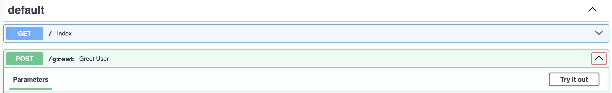
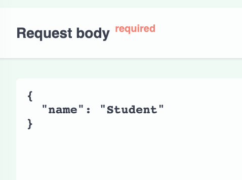

# Create your first API with FastAPI

An API, or *Application Programming Interface*, is a set of rules that allows different software applications to communicate with each other. It defines methods and data formats that a program can use to perform tasks, retrieve data, and interact with other software components.

FastAPI is a modern, fast (high-performance), web framework for building APIs with Python 3.6+ based on standard Python type hints. It's easy to use and is designed to be easy to code and understand, thanks to its intuitive design and autocompletion.

The key features of FastAPI include:
- Fast: Very high performance, on par with NodeJS and Go (thanks to Starlette and Pydantic).
- Easy: Designed to be easy to use and learn. Less time reading docs.
- Short: Minimize code duplication. Multiple features from each parameter declaration.
- Robust: Get production-ready code. With automatic interactive documentation.
- Standards-based: Based on (and fully compatible with) the open standards for APIs.
- Pythonic: Very expressive and easy to use, strong editor and linter support.

If you want have a comple introduction to it, please check the [documentation](https://fastapi.tiangolo.com/)

## First Steps

The simplest app you can create with FastAPI looks like this:

```python
from fastapi import FastAPI

# Initiate the FastAPI app that will be run
app = FastAPI()

# Initiate the homepage of the API
@app.get("/")
def index():
    return {"message": "This is the homepage of the API "}
```

The `app` variable is the main entry point of the API. All operations that are added to the API will be indexed using this entrypoint. To create an operation, you need to write a `function` and decorate it with a specific `operation` and `path`.

-  The function will specify the behaviour that you expect from you API. In this very simple example, we create a simple function that always returns the same value, a dictionary with a standard message.

FastAPI uses the decorator syntax to specify the `operation` and `path`:

-  `Operations` often refer to the methods of the HTTP protocol:
    - `POST`: Create (Used to create new resources)
    - `GET`: Read (Retrieve a representation of a resource)
    - `PUT`: Update (Update or Create a resource)
    - `DELETE`: Delete (Used to delete a resource)
    In our use cases, we will only deal with `POST` and `GET` operations

- The `path` refer to the last part of the URL after the endpoint. In our example, we created a root path that would look like this:
    ```https://my-endpoint/```

You can copy the code into a file called `main.py` in this `fast_api_tutorial` folder.

To launch the app, you should run in your terminal:

```bash
cd lessons/02-model-deployment/fast_api_tutorial
```

```bash
uvicorn main:app --reload
```

[`Uvicorn`](https://www.uvicorn.org/) is a tool that helps your Python web applications run quickly and handle many tasks at the same time. We are using it here to run our FastAPI application. The command we used tells it to look for the `app` object inside our `main.py` file. The `--reload` option relaunches the application every time the code changes (it should only be used in development).

## Check your new app

By default, `uvicorn` will deploy the app on your localhost on the port 8000 [http://localhost:8000](http://localhost:8000). Clicking on this link will show you the home page of your API and display the message you coded.

<details>
<summary> If you want more information on the meaning of host and port</summary>

> **Host**: In networking, a host refers to a device that is connected to a network and can send or receive data. For example, a computer, smartphone, or server can be referred to as a host in a network.

> **Port**: A port is a specific point where data can enter or leave a host. It is associated with a specific process or service in the host system. For example, web servers typically listen on port 80 for incoming HTTP requests.

- [Host vs Localhost vs Port](https://stackoverflow.com/questions/1946193/whats-the-whole-point-of-localhost-hosts-and-ports-at-all)
- [127.0.0.1 vs 0.0.0.0](https://stackoverflow.com/questions/20778771/what-is-the-difference-between-0-0-0-0-127-0-0-1-and-localhost)

</details>

A nice feature of FastAPI is that it automatically generates a documentation page accessible at [http://localhost:8000/docs](http://localhost:8000/docs)


## Create a POST operation

The next step is to create an operation that receives information from the user and uses it internally to modify its response. The `POST` operation is the way that we can communicate information to our endpoint.

```python
from fastapi import FastAPI
from pydantic import BaseModel

# Define a data model for the request body
class Item(BaseModel):
    name: str

# Initiate the FastAPI app
app = FastAPI()

# Initiate the homepage of the API
@app.get("/")
def index():
    return {"message": "This is the homepage of the API "}

# Define a POST operation for the path "/greet"
@app.post("/greet")
def greet_user(item: Item):
    return {"message": f"Hello, {item.name}"}
```

In this example, we define a POST operation at the path "/greet". The `function` we defined accepts one parameter `item` that is used to generate a simple greeting.

One useful feature of `FastAPI` is that it performs automatic data validation using python's type hints. To do so, it uses the [pydantic](https://docs.pydantic.dev/latest/) package, which allows us to create `models` that enforce data structures in our code. In our example, the operation expects a JSON body with a field "name". The Item class is a `pydantic` model that helps with data validation and serialization. When a POST request is made to "/greet" with a JSON body like {"name": "Alice"}, the server will respond with {"message": "Hello, Alice"}.

To run this application, overwrite the code in `main.py` and use the same command to launch the app:

```bash
uvicorn main:app --reload
```

### Testing the app

To test your new operation, you can connect to [localhost:8000/docs](localhost:8000/docs) and use the `Try it out` option to send your own request:



You can modify the `Request body` to include your name:



You can do the same operations directly from your terminal, by running:

```bash
# The curl command is a tool to transfer data from or to a server, using one of the supported protocols (HTTP, HTTPS, FTP, etc.)
# The -X option specifies a custom request method to use when communicating with the HTTP server. In this case, 'POST' is used.
curl -X 'POST' \
# The URL of the server to which the request is sent
  'http://localhost:8000/greet' \
# Headers are used to provide information to both the client and server. They define the operating parameters of an HTTP transaction.
# The -H option is used to include extra header information. 'accept: application/json' tells the server that the client expects JSON response.
  -H 'accept: application/json' \
# 'Content-Type: application/json' tells the server that the client is sending JSON data in the body of the request.
  -H 'Content-Type: application/json' \
# The -d option is used to send data in a POST request. It sends the following data to the server in JSON format.
  -d '{
  "name": "Student"
}'
```

<details>
    <summary>Curl in Windows</summary>

If you are using a Windows machine, the `curl` command will probably not be intalled. You can follow the instructions of this [tutorial](https://developer.zendesk.com/documentation/api-basics/getting-started/installing-and-using-curl/#using-curl-in-windows) to adapt the command.
</details>

You can also check that `pydantic` is performing the data validation well by sending a bad request:

```bash
curl -X 'POST' \
  'http://localhost:8000/greet' \
  -H 'accept: application/json' \
  -H 'Content-Type: application/json' \
  -d '{
  "name": 70
}'
```

The response you get should be a `422` error:

```
{"detail":[{"type":"string_type","loc":["body","name"],"msg":"Input should be a valid string","input":70,"url":"https://errors.pydantic.dev/2.4/v/string_type"}]}
```

## Recap

In this tutorial, we learned how to create a simple API using FastAPI. We started by setting up a basic FastAPI application and defining a GET operation for the root path. We then learned how to launch the application using Uvicorn and how to access the API's homepage and auto-generated documentation.

Next, we added a POST operation to our API that accepts a JSON body and returns a personalized greeting. We learned how FastAPI uses Pydantic models for automatic data validation and serialization, and how to test our new operation using both the auto-generated documentation and curl commands in the terminal.

Overall, FastAPI provides a fast, easy, and Pythonic way to create robust APIs with automatic data validation and interactive documentation.
