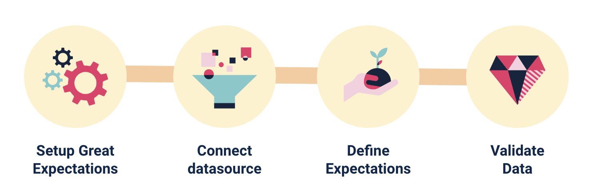
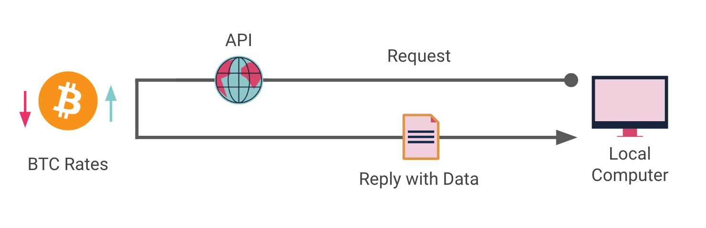
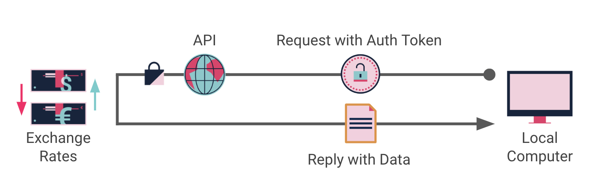

## Module Program - Data Management

### Exercise 01 : Create Data Quality checks with Great Expectations

Welcome to the first exercise where you will explore the tool [Great Expectations](https://greatexpectations.io/) to set-up automated Data Quality checks. Great Expectations (or GX) is an open-source data validation and documentation tool that allows users to define expected structure, content, and constraints of their data to automatically validate that they actually meets those expectations, using Python code. This helps users ensure that their data is clean, accurate, and ready for analysis or modeling.

In this exercise we will follow the four steps of GX tutorial, applied to our NYC Taxi dataset.
1) Setup Great Expectations
2) Connect datasource
3) Define Expectations
4) Validate data

Please follow the notebooks 03-01-setup-quality-tests to complete this exercise.

### Exercise 02 : PULL data from the Internet with a free and open API

Second exercise of the Data Management course where you will pull and integrate your first API data, starting with an easy example of a publicly open and free API that doesn't require any credentials to connect.

With this exercise you will be able to code all the flow, from the request to the transformation of the JSON format into a CSV that is then persisted localy.

Please follow the notebooks 03-02-connect-to-open-api to complete this exercise.

### Exercise 03 : PULL data from the Internet with a free and secured API

Third exercise of the Data Management course where you will pull and integrate your second API data, going further and using a secured API using Authentication token.

With this exercise you will be able to code all the flow, from the request to the transformation of the JSON format into a CSV that is then persisted localy.

Please follow the notebooks 03-03-connect-to-secured-api to complete this exercise.
